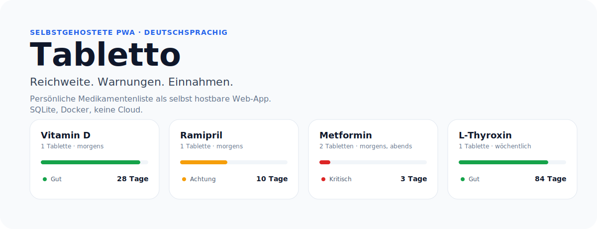
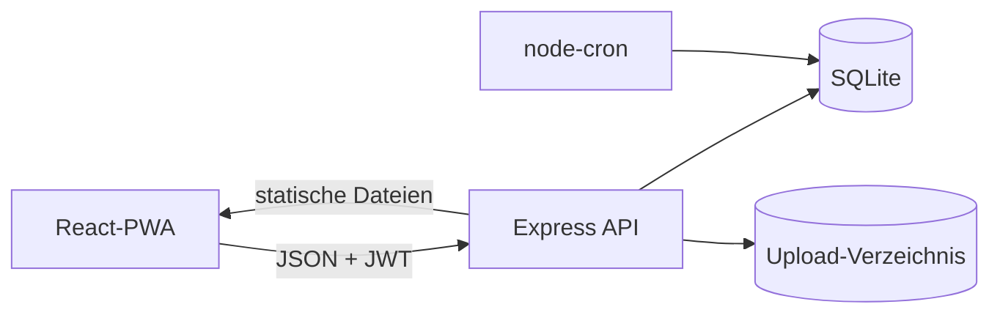

<p align="center">
  
</p>

<p align="center">
  Tabletto ist eine selbst hostbare, deutschsprachige Web-App zur Verwaltung
  persönlicher Medikamentenbestände. Sie berechnet Reichweiten, markiert
  kritische Bestände und zieht geplante Einnahmen automatisch vom Bestand ab.
  SQLite, Docker, keine Cloud, keine Diagnose.
</p>

> Tabletto ist ein Organisationswerkzeug. Die Anwendung stellt keine Diagnose,
> ersetzt keine ärztliche Beratung und entscheidet nicht über Dosierungen.

## Was Tabletto kann

- **Reichweiten & Statusfarben** – pro Medikament wird aus Bestand und
  Dosierung die verbleibende Zeit berechnet und in „Gut / Achtung / Kritisch"
  eingefärbt.
- **Tägliche und wöchentliche Einnahmen** – Morgen-, Mittags- und Abenddosis
  sowie mehrtägige Intervalle mit eigener Fälligkeit.
- **Zeitgesteuerter Abzug** – ein Scheduler zieht fällige Dosen vom Bestand ab
  und schreibt eine vollständige Historie.
- **Bestandswarnungen per E-Mail** *(optional)* – wöchentliche Übersicht am
  Sonntag um 18:00 und eine konsolidierte Warnung, sobald ein Medikament in
  einen kritischen Status kippt. Empfänger ist die registrierte E-Mail-Adresse.
- **Kalender- und Kachelansicht** – prognostizierte Leerstandsdaten als
  Kalenderereignis, alternative Listen- und Rasteransichten.
- **JSON-Import und -Export** – versioniertes Format inklusive Intervall- und
  Historie-Felder, vollständig transaktional.
- **Medikamentenfotos** – bis 5 MiB, signierte Kurzzeit-URLs, geprüfte
  Bildsignaturen.
- **Installierbare PWA** – offline-fähige Anwendungshülle, responsives Layout
  für Desktop und Mobilgeräte, Tastaturnavigation.

## Schnellstart mit Docker

```bash
git clone https://github.com/oliverbenduhn/tabletto.git
cd tabletto
cp .env.example .env
```

In `.env` ein starkes Secret setzen:

```dotenv
JWT_SECRET=$(openssl rand -base64 48)
```

Dann:

```bash
docker compose up -d --build
docker compose logs -f tabletto
```

Tabletto läuft anschließend unter <http://localhost:3000>. SQLite und Uploads
liegen im Docker-Volume `tabletto-data`.

Ausführliche Schritte, Reverse-Proxy und Backup: [INSTALL.md](INSTALL.md).

## Lokale Entwicklung

```bash
npm run install:all
cp .env.example .env
mkdir -p backend/data backend/uploads
```

In `.env` für Entwicklung anpassen:

```dotenv
JWT_SECRET=only-for-local-development
DB_PATH=./data/tabletto.db
UPLOADS_PATH=./uploads
ENABLE_STOCK_SCHEDULER=false
TZ=Europe/Berlin
```

Backend und Frontend in zwei Terminals:

```bash
npm run dev:backend
```

```bash
VITE_API_URL=http://localhost:3000/api npm run dev:frontend
```

Vite-Frontend: <http://localhost:5173>. API: <http://localhost:3000/api>.

## Build und Tests

```bash
npm run build:frontend
npm test --prefix backend
npm run test:e2e
```

Der E2E-Runner baut das Frontend, startet das Backend auf Port 3030 mit
frischer SQLite unter `/tmp/tabletto-e2e.db`, deaktiviert den Scheduler und
fährt gegen die echte HTTP-API. Geprüft werden API-Vertrag, E2E-Benutzerreisen,
Benachrichtigungen inklusive Fake-SMTP sowie UX-Audits in Desktop- und
mobilier Ansicht.

## Konfiguration

Die wichtigsten Umgebungsvariablen – vollständige Liste in
[docs/operations.md](docs/operations.md):

| Variable | Standard | Zweck |
|---|---|---|
| `JWT_SECRET` | unsicherer Fallback (Entwicklung) | JWT-Signatur; in Produktion zwingend |
| `PORT` | `3000` | Express-Port |
| `DB_PATH` | `backend/data/tabletto.db` | SQLite-Datei |
| `UPLOADS_PATH` | `backend/uploads` | Upload-Root |
| `FRONTEND_ORIGIN` | Entwicklung `*`, Produktion deaktiviert | CORS-Ursprung |
| `ENABLE_STOCK_SCHEDULER` | `true` | Scheduler an/aus |
| `TZ` | `Europe/Berlin` | Zeitzone des Cron-Ticks |
| `SMTP_HOST`, `SMTP_FROM` | nicht gesetzt | aktivieren E-Mail-Benachrichtigungen |
| `WEEKLY_DIGEST_CRON` | `0 18 * * 0` | Sonntag 18:00 in `TZ` |

Ohne `SMTP_HOST` und `SMTP_FROM` ist das Benachrichtigungsmodul ein No-Op –
App und Scheduler laufen unverändert weiter.

## Architektur in Kürze



Express folgt im Normalfall `Route → Controller → Model → SQLite`. Der
Scheduler läuft im selben Node.js-Prozess wie der HTTP-Server und prüft alle
fünf Minuten in der konfigurierten Zeitzone. Berechnete Medikamentenwerte
(`warning_status`, `depletion_date`) werden vor der API-Antwort ergänzt und
nicht persistiert.

Mehr: [docs/architecture.md](docs/architecture.md) ·
[docs/data-model.md](docs/data-model.md).

## Dokumentation

- [Wiki-Übersicht](docs/index.md)
- [HTTP-API](docs/api.md)
- [Entwicklung](docs/development.md)
- [Betrieb und Backup](docs/operations.md)
- [Tests](docs/testing.md)
- [Sicherheit](docs/security.md)
- [Änderungshistorie](CHANGELOG.md)
- [Regeln für KI-Agenten](AGENTS.md)
- [Glossar](CONTEXT.md)
- [ADR: SMTP global in `.env`](docs/adr/0001-smtp-global-in-env.md)

## Bewusste Einschränkungen

- **Foto-Binärdaten** sind nicht Teil des JSON-Exports; ein Restore umfasst
  nur Medikamente und Historie.
- **JWTs** liegen in `localStorage`; deshalb werden authentifizierte
  API-Antworten bewusst nicht im Service Worker gespeichert.
- **SQLite** ist auf einen Anwendungscontainer ausgelegt. Mehrere schreibende
  Replikate auf demselben Volume sind kein unterstützter Betriebsmodus.
- **Tabletto ist kein Medizinprodukt** und trifft keine Dosierungs- oder
  Therapieentscheidungen.

## Lizenz

[MIT](LICENSE).