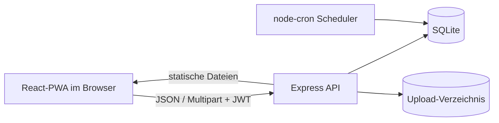

# Tabletto

Tabletto ist eine selbst hostbare, deutschsprachige Webanwendung zur Verwaltung
persönlicher Medikamentenbestände. Sie berechnet Reichweiten, visualisiert
kritische Bestände und kann geplante Einnahmen automatisch vom Bestand abziehen.

> Tabletto ist ein Organisationswerkzeug. Die Anwendung stellt keine Diagnose,
> ersetzt keine ärztliche Beratung und entscheidet nicht über Dosierungen.

## Funktionen

- Registrierung und Login mit JWT und bcrypt
- getrennte Datenbestände pro Benutzer
- tägliche Einnahmen morgens, mittags und abends
- Einnahmeintervalle von mehreren Tagen
- automatische Reichweiten- und Leerstandsberechnung
- konfigurierbare Bestandswarnungen
- manueller und zeitgesteuerter Bestandsabzug mit Historie
- Medikamentenfotos bis 5 MiB
- Kalender-, Raster- und Listenansicht
- JSON-Import und -Export
- installierbare Progressive Web App
- responsive Oberfläche für Desktop und Mobilgeräte

## Tech-Stack

| Bereich | Technologie |
|---|---|
| Frontend | React 18, Vite 6, Tailwind CSS, FullCalendar |
| Backend | Node.js 22, Express 5, CommonJS |
| Persistenz | SQLite, lokales Upload-Verzeichnis |
| Authentifizierung | JWT, bcrypt, Express Rate Limit |
| Hintergrundaufgaben | `node-cron` |
| Tests | Playwright, Desktop Chrome und Pixel 7 |
| Betrieb | Docker, Docker Compose, GitHub Actions |

## Voraussetzungen

Für den empfohlenen Containerbetrieb:

- Docker Engine 20.10 oder neuer
- Docker Compose v2
- freier TCP-Port 3000

Für lokale Entwicklung zusätzlich:

- Node.js 20.17 oder neuer; Node.js 22 empfohlen
- npm

## Schnellstart mit Docker

```bash
git clone https://github.com/oliverbenduhn/tabletto.git
cd tabletto
cp .env.example .env
```

In `.env` mindestens ein starkes Secret setzen:

```dotenv
JWT_SECRET=<zufälliges-langes-secret>
```

Ein Secret kann beispielsweise so erzeugt werden:

```bash
openssl rand -base64 48
```

Anwendung bauen und starten:

```bash
docker compose up -d --build
docker compose logs -f tabletto
```

Tabletto ist anschließend unter <http://localhost:3000> erreichbar. Die
SQLite-Datenbank und Uploads liegen im Docker-Volume `tabletto-data`.

Ausführliche Schritte und Fehlerbehebung: [INSTALL.md](INSTALL.md).

## Lokale Entwicklung

Abhängigkeiten installieren:

```bash
npm run install:all
mkdir -p backend/data backend/uploads
```

Für lokale Entwicklung die Root-Datei `.env` anpassen:

```dotenv
JWT_SECRET=only-for-local-development
PORT=3000
DB_PATH=./data/tabletto.db
UPLOADS_PATH=./uploads
ENABLE_STOCK_SCHEDULER=false
TZ=Europe/Berlin
```

Backend und Frontend in getrennten Terminals starten:

```bash
npm run dev:backend
```

```bash
VITE_API_URL=http://localhost:3000/api npm run dev:frontend
```

Das Vite-Frontend läuft üblicherweise unter <http://localhost:5173>; die API
unter <http://localhost:3000/api>.

## Build und Tests

```bash
npm run build:frontend
npm run test:e2e
```

Weitere Varianten:

```bash
npm run test:e2e:headed
npm run test:e2e:report
```

Der E2E-Runner baut das Frontend, startet das Backend auf Port 3000, verwendet
`/tmp/tabletto-e2e.db` und deaktiviert den Scheduler. Er prüft die wichtigsten
  Benutzerreisen in einer Desktop- und einer mobilen Ansicht. `npm test --prefix
  backend` prüft Validierung, Uploadpfade, Migration und Scheduler-Idempotenz.

## Konfiguration

| Variable | Standard | Bedeutung |
|---|---|---|
| `JWT_SECRET` | nur Entwicklung: unsicherer Fallback | Signatur der JWTs; Produktion startet ohne echtes Secret nicht |
| `PORT` | `3000` | Port des Express-Servers |
| `DB_PATH` | Backend-lokaler Pfad | SQLite-Datei; Container: `/app/data/tabletto.db` |
| `UPLOADS_PATH` | `backend/uploads` | Root-Verzeichnis persistenter Uploads |
| `FRONTEND_ORIGIN` | Entwicklung: `*`, Produktion: deaktiviert | optional erlaubter externer Frontend-Ursprung |
| `ENABLE_STOCK_SCHEDULER` | `true` | Scheduler mit `false` deaktivieren |
| `STOCK_SCHEDULER_CRON` | `*/5 * * * *` | Prüfintervall des Schedulers |
| `TZ` | `Europe/Berlin` | Zeitzone des Cron-Jobs |
| `VITE_API_URL` | `/api` | API-Basis-URL beim Frontend-Build |

Alle Betriebsdetails stehen in [docs/operations.md](docs/operations.md).

## Architektur in Kürze



Das Backend folgt im Normalfall `Route -> Controller -> Model -> SQLite`.
Berechnete Medikamentenwerte werden vor der API-Antwort ergänzt. Der Scheduler
läuft im selben Node.js-Prozess wie der HTTP-Server.

Weitere Details: [docs/architecture.md](docs/architecture.md).

## Deployment

Das Produktionsimage wird mehrstufig gebaut:

1. Backend-Abhängigkeiten und React-PWA werden im Builder erzeugt.
2. Das Runtime-Image enthält Backend, Frontend-Build, `curl` und `gosu`.
3. Der Entrypoint setzt Datenverzeichnisrechte und startet als `appuser`.

Für Produktion sind mindestens erforderlich:

- starkes `JWT_SECRET`,
- persistentes Volume für `/app/data`,
- HTTPS über einen Reverse Proxy,
- eingeschränktes `FRONTEND_ORIGIN`,
- überwachte, regelmäßig getestete Backups.

Komodo-Deployment: [DEPLOY-KOMODO.md](DEPLOY-KOMODO.md). Betrieb, Backup und
Restore: [docs/operations.md](docs/operations.md).

## Repository-Struktur

```text
tabletto/
├── backend/             Express-API, Models, Scheduler und Betriebsskripte
├── frontend/            React-PWA
├── tests/e2e/           Playwright-Benutzerreisen und UX-Audit
├── docs/                versioniertes Projekt-Wiki
├── AGENTS.md            kanonische Regeln für KI-Agenten
├── Dockerfile
├── compose.yaml
└── package.json         gemeinsame Entwicklungsbefehle
```

## Dokumentation

- [Wiki-Übersicht](docs/index.md)
- [Architektur und Datenflüsse](docs/architecture.md)
- [Datenmodell](docs/data-model.md)
- [HTTP-API](docs/api.md)
- [Entwicklung](docs/development.md)
- [Betrieb](docs/operations.md)
- [Tests](docs/testing.md)
- [Sicherheit](docs/security.md)
- [Änderungshistorie](CHANGELOG.md)
- [Regeln für KI-Agenten](AGENTS.md)

## Bewusste Einschränkungen

- Exportdateien enthalten keine Foto-Binärdaten; ein Restore stellt deshalb nur
  Medikamente und Historie wieder her.
- JWTs liegen weiterhin in `localStorage`; deshalb werden API-Antworten nicht im
  Service Worker gespeichert und Security-Header begrenzen die XSS-Angriffsfläche.
- SQLite bleibt auf einen Anwendungscontainer ausgelegt. Mehrere schreibende
  Replikate auf demselben Volume sind kein unterstütztes Betriebsmodell.

## Lizenz

Tabletto steht unter der [MIT-Lizenz](LICENSE).
