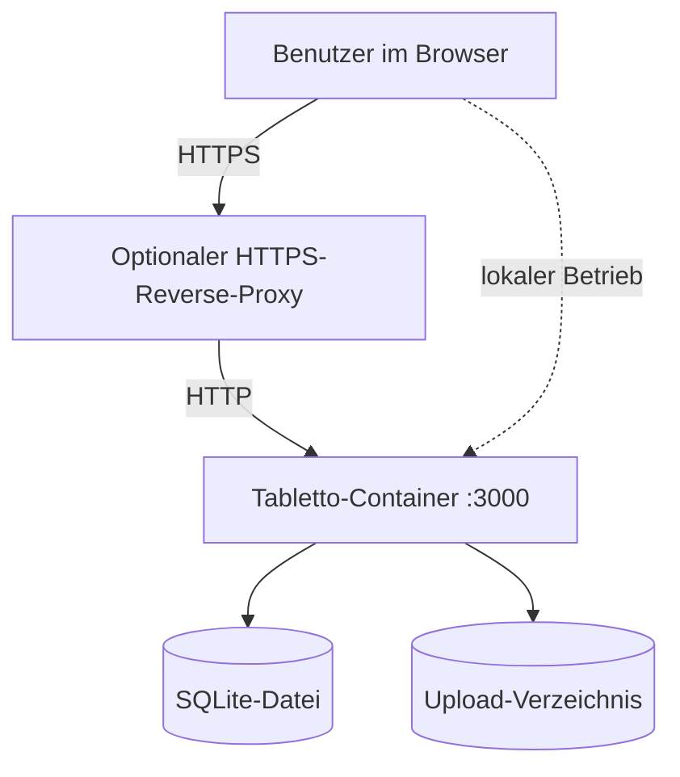
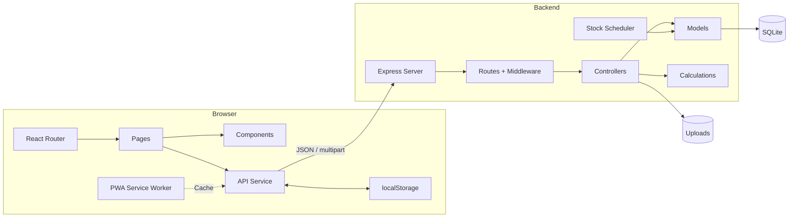
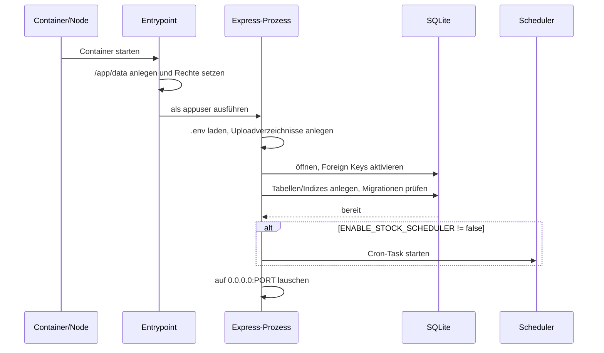
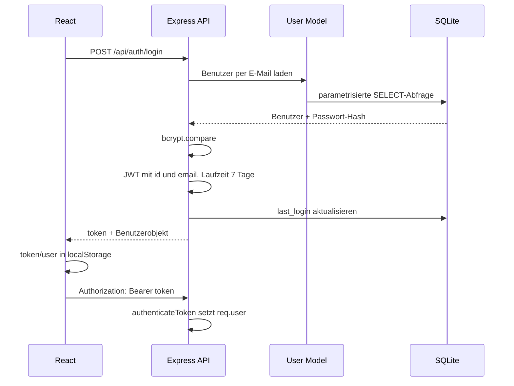
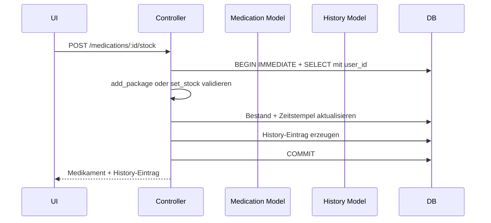
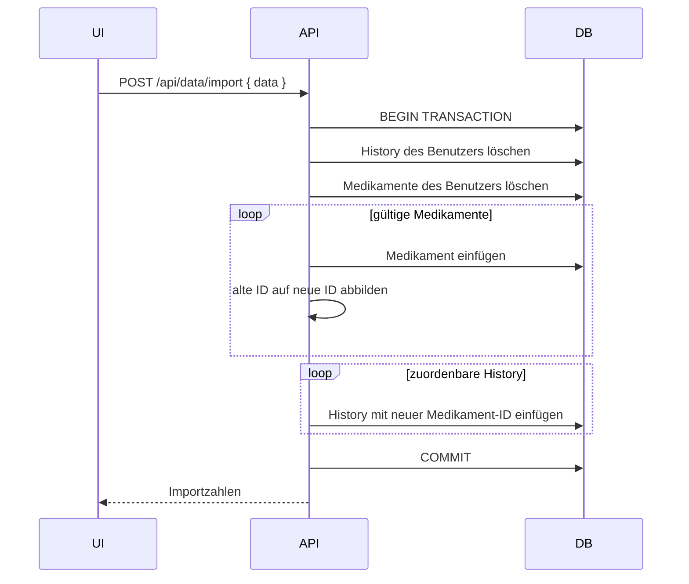

# Architektur und Datenflüsse

## Systemkontext

Tabletto hat keine externen Fachservices. Der Browser kommuniziert ausschließlich
mit dem Express-Prozess. Datenbank und Uploads müssen gemeinsam persistent und
gesichert werden.

## Komponenten

### Backend-Schichten

- `server.js` lädt `.env`, initialisiert Middleware, Uploadverzeichnisse,
  Routen, statische Dateien, Datenbank und Scheduler.
- `routes/` bindet HTTP-Methoden, Authentifizierung und Multer.
- `controllers/` validiert Request-Daten, orchestriert Models und formt
  Responses.
- `models/` kapselt die normalen SQL-Zugriffe und begrenzt Medikamente auf den
  angemeldeten Benutzer.
- `services/stockScheduler.js` führt zeitbasierte Bestandsänderungen aus.
- `utils/calculations.js` ergänzt persistierte Medikamente um abgeleitete Werte.
- `utils/uploads.js` normalisiert physische Pfade und erzwingt Root-Containment;
  Controller erzeugen signierte Kurzzeit-URLs.

Einige komplexe Transaktionen und der Scheduler greifen direkt auf SQLite zu.
Das ist eine bestehende, bewusst eng zu haltende Ausnahme vom Model-Zugriff.

### Frontend-Schichten

- `App.jsx` definiert öffentliche und durch `PrivateRoute` geschützte Routen.
- Seiten laden Daten und koordinieren Dialoge und Navigation.
- Komponenten bilden Formulare, Listen, Details und wiederverwendbare UI ab.
- `services/api.js` ist die zentrale HTTP-Grenze und ergänzt den JWT-Header.
- Der JWT und das Benutzerobjekt werden in `localStorage` gespeichert.
- Vite PWA registriert einen Service Worker für die statische Anwendungshülle.
  Authentifizierte API-Antworten werden aus Datenschutzgründen nicht gecacht.

## Prozessstart

Bei `SIGTERM` oder `SIGINT` werden Cron-Task, HTTP-Server und Datenbankverbindung
kontrolliert geschlossen.

## Authentifizierungsfluss

Fehlender Token führt zu 401, ein ungültiger oder abgelaufener Token zu 403.
Es gibt keinen serverseitigen Session- oder Revocation-Speicher.

## Medikament lesen und anreichern

Persistierte Medikamentenzeilen enthalten Rohdaten. Vor API-Antworten ergänzt
`enrichMedication`:

- `daily_consumption`
- `days_remaining`
- `depletion_date`
- `warning_status`
- `days_until_next_dose`
- `intervals_remaining`
- normalisierte Intervallfelder
- `photo_url`

Diese Felder werden nicht als Momentaufnahme gespeichert und können sich allein
durch Zeitablauf ändern.

## Manuelle Bestandsänderung

Alle Prozessschreibvorgänge teilen eine Queue. Bestandsupdate und History-Insert
laufen in derselben SQLite-Transaktion und werden gemeinsam zurückgerollt.

## Automatischer Bestandsabzug

Der Cron-Task läuft standardmäßig alle fünf Minuten in `TZ=Europe/Berlin`:

- zur Morgenzeit: `dosage_morning` täglicher Medikamente,
- zur Mittagszeit: `dosage_noon` täglicher Medikamente und komplette Dosis von
  Intervallmedikamenten,
- zur Abendzeit: `dosage_evening` täglicher Medikamente.

Ab der jeweiligen Einnahmezeit verarbeitet der Scheduler den lokalen Tag. Die
Tabelle `stock_deductions` besitzt einen eindeutigen Schlüssel aus Medikament,
Slot und geplantem Tag. Wiederholte Cron-Ticks sind dadurch idempotent; nach
Downtime werden bereits begonnene Tagesfolgen nachgeholt.

Bei Intervallmedikamenten wird `next_due_at` nach einem Abzug um
`interval_days` weitergeschoben. Bestände werden mit `Math.max(0, ...)` bei null
begrenzt. Jeder automatische Abzug erzeugt einen History-Eintrag.

## Benachrichtigungen

Die Statuserkennung läuft am Ende jedes Scheduler-Ticks: für jeden Benutzer
mit aktivem Status-Toggle wird der aktuelle `warning_status` ermittelt und
gegen `medications.last_notified_status` verglichen. Verschlechterungen
(`good → warning`, `good → critical`, `warning → critical`) lösen eine
konsolidierte E-Mail pro Benutzer aus; Erholungen aktualisieren nur den
Marker, ohne Mail. SMTP-Fehler werden geloggt und schluckt; das eigentliche
Funktionsverhalten ist davon unabhängig.

Die wöchentliche Bestandsinfo-Mail feuert sonntags um 18:00 Europe/Berlin
(`WEEKLY_DIGEST_CRON` überschreibbar) und iteriert Benutzer mit aktivem
Toggle. Sie enthält Counts je Warnstatus und eine Liste der Medikamente mit
 kritischem oder gelbem Status samt Leerstandsdaten. Grüne Medikamente werden
bewusst weggelassen.

Ein authentifizierter Benutzer kann denselben Renderer und SMTP-Transport über
`POST /api/user/notifications/test-weekly` explizit testen. Dieser Pfad ist auf
den angemeldeten Benutzer begrenzt, ignoriert bewusst den Wochen-Opt-in und
verändert weder Einstellungen noch Bestandsdaten.

SMTP-Zugangsdaten werden ausschließlich aus der Backend-Umgebung gelesen.
Fehlt `SMTP_HOST` oder `SMTP_FROM`, ist das Mailmodul ein No-Op; Scheduler
und API bleiben voll funktionsfähig.

## Import und Export

Der Import ist ein Replace, kein Merge. Die gesamte Datei wird vor der
Transaktion validiert. Fotos und `photo_path` werden nicht exportiert oder
importiert; alte lokale Fotos werden nach erfolgreichem Commit entfernt.

## Foto-Upload

Multer akzeptiert JPEG, PNG, GIF und WebP bis fünf MiB, verwendet eine feste
Erweiterung pro MIME-Typ und prüft anschließend die Dateisignatur. Fotos werden
über kurzlebig HMAC-signierte URLs ausgeliefert; das Upload-Root ist nicht
öffentlich gemountet. Pfadauflösung muss innerhalb des Upload-Roots bleiben.

## Kalenderdatenfluss

Der Kalender lädt dieselbe Medikamentenliste wie das Dashboard. Für jedes
Medikament mit `depletion_date` erzeugt das Frontend genau ein Ereignis am
prognostizierten Leerstandsdatum. Ereignisfarben entsprechen dem API-Warnstatus;
ein Klick navigiert zur Medikamentendetailseite.

## Architekturgrenzen

- Eine Backendinstanz verwaltet eine SQLite-Datei. Mehrere schreibende Replikate
  auf demselben Volume sind nicht vorgesehen.
- Eindeutige DB-Marker verhindern doppelte Schedulerbuchungen. Mehrere
  schreibende App-Replikate auf derselben SQLite-Datei bleiben dennoch außerhalb
  des unterstützten Betriebsmodells.
- SQLite und Uploads bilden gemeinsam den vollständigen persistenten Zustand.
- Das Frontend vertraut nicht auf versteckte Routen als Autorisierung; das
  Backend muss jede benutzerbezogene Operation selbst begrenzen.
