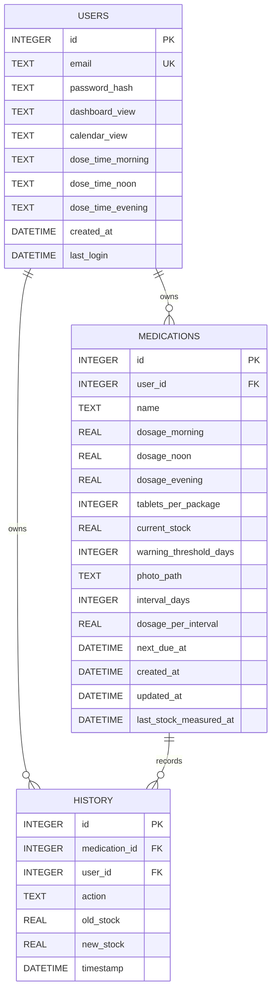

# Datenmodell

## Speicher und Initialisierung

SQLite wird über `sqlite` und `sqlite3` geöffnet. Der Pfad kommt aus `DB_PATH`
oder fällt lokal auf `backend/data/tabletto.db` zurück. Nach dem Öffnen aktiviert
das Backend `PRAGMA foreign_keys = ON`, erzeugt Basistabellen und Indizes und
führt anschließend spaltenweise Migrationen aus.

## ER-Diagramm



## `users`

| Spalte | Typ | Null | Standard | Bedeutung |
|---|---|---:|---|---|
| `id` | INTEGER | nein | Auto-ID | interne Benutzer-ID |
| `email` | TEXT | nein | – | eindeutiger Loginname |
| `password_hash` | TEXT | nein | – | bcrypt-Hash, nie API-Ausgabe |
| `dashboard_view` | TEXT | ja | `grid` | `grid` oder `list` |
| `calendar_view` | TEXT | ja | `dayGridMonth` | Monatsraster oder `listMonth` |
| `dose_time_morning` | TEXT | ja | `08:00` | lokale Uhrzeit `HH:MM` |
| `dose_time_noon` | TEXT | ja | `12:00` | lokale Uhrzeit `HH:MM` |
| `dose_time_evening` | TEXT | ja | `20:00` | lokale Uhrzeit `HH:MM` |
| `created_at` | DATETIME | ja | aktuelle DB-Zeit | Registrierung |
| `last_login` | DATETIME | ja | null | letzter erfolgreicher Login |

Index: `idx_users_email`. Die Eindeutigkeit wird zusätzlich durch `UNIQUE`
garantiert.

## `medications`

| Spalte | Typ | Null | Standard | Bedeutung |
|---|---|---:|---|---|
| `id` | INTEGER | nein | Auto-ID | Medikament-ID |
| `user_id` | INTEGER | nein | – | Eigentümer, FK auf `users.id` |
| `name` | TEXT | nein | – | Anzeigename, maximal 100 Zeichen |
| `dosage_morning` | REAL | nein | `0` | tägliche Morgendosis |
| `dosage_noon` | REAL | nein | `0` | tägliche Mittagsdosis |
| `dosage_evening` | REAL | nein | `0` | tägliche Abenddosis |
| `tablets_per_package` | INTEGER | nein | – | Standardmenge für `add_package` |
| `current_stock` | REAL | nein | `0` | aktueller Bestand |
| `warning_threshold_days` | INTEGER | nein | `7` | Grenze für `critical` |
| `photo_path` | TEXT | ja | null | relativer, serverseitig erzeugter Uploadpfad |
| `interval_days` | INTEGER | ja | `1` | Tage zwischen Einnahmen |
| `dosage_per_interval` | REAL | ja | `0` | Dosis eines Intervalltermins |
| `next_due_at` | DATETIME | ja | null | nächster Fälligkeitstermin |
| `created_at` | DATETIME | ja | aktuelle DB-Zeit | Anlagezeit |
| `updated_at` | DATETIME | ja | aktuelle DB-Zeit | letzte fachliche Änderung |
| `last_stock_measured_at` | DATETIME | ja | aktuelle DB-Zeit | letzte manuelle Mess-/Änderungsbasis |

Fremdschlüssel: `user_id -> users.id ON DELETE CASCADE`.
Index: `idx_medications_user`.

### Dosierungsmodi

Täglich:

```text
interval_days = 1
daily_consumption = dosage_morning + dosage_noon + dosage_evening
```

Intervall:

```text
interval_days > 1
dosage_per_interval = Menge pro Fälligkeit
next_due_at = nächste Fälligkeit
```

Das Model setzt `dosage_per_interval` ohne expliziten Wert auf die Summe der
drei Tagesdosierungen. Ein bewusst übergebener Wert `0` bleibt erhalten.

### Abgeleitete Werte

Die API berechnet zur Laufzeit:

```text
intervals_remaining = current_stock / dosage_per_interval
daily: days_remaining = intervals_remaining
interval: days_remaining = Tage bis zur nächsten Dosis
                           + (intervals_remaining - 1) * interval_days
depletion_date = heute + floor(days_remaining)
```

Bei Dosis null liefert die API explizit `days_remaining = null` und
`depletion_date = null`. Nicht endliche Zahlen gelangen nicht in den JSON-Vertrag.

Warnstatus:

1. `critical`, wenn Resttage kleiner als null oder kleiner als
   `warning_threshold_days` sind,
2. `warning`, wenn Resttage kleiner als 14 sind,
3. sonst `good`.

## `history`

| Spalte | Typ | Null | Standard | Bedeutung |
|---|---|---:|---|---|
| `id` | INTEGER | nein | Auto-ID | Ereignis-ID |
| `medication_id` | INTEGER | nein | – | FK auf Medikament |
| `user_id` | INTEGER | nein | – | FK und zusätzliche Mandantengrenze |
| `action` | TEXT | nein | – | Aktionstyp |
| `old_stock` | REAL | ja | null | Bestand vor Änderung |
| `new_stock` | REAL | ja | null | Bestand nach Änderung |
| `timestamp` | DATETIME | ja | aktuelle DB-Zeit | Ereigniszeit |

Fremdschlüssel:

- `medication_id -> medications.id ON DELETE CASCADE`
- `user_id -> users.id ON DELETE CASCADE`

Indizes: `idx_history_medication`, `idx_history_user`.

Bekannte Aktionstypen:

| Aktion | Auslöser |
|---|---|
| `add_package` | Packungsmenge manuell addiert |
| `set_stock` | Bestand absolut gesetzt |
| `auto_deduction_morning` | automatische Morgendosis |
| `auto_deduction_noon` | automatische Mittagsdosis |
| `auto_deduction_evening` | automatische Abenddosis |
| `auto_deduction_interval` | automatische Intervall-Dosis |
| `manual_correction` | Korrekturskript setzt negativen Bestand auf null |

Die Spalte besitzt keine Datenbank-Constraint auf diese Werte. Importierte oder
ältere Daten können weitere Aktionen enthalten.

## `stock_deductions`

| Spalte | Bedeutung |
|---|---|
| `medication_id`, `user_id` | fachlicher Datensatz und Eigentümer |
| `slot` | `morning`, `noon`, `evening` oder `interval` |
| `scheduled_for` | lokaler geplanter Kalendertag `YYYY-MM-DD` |
| `created_at` | Zeitpunkt des erfolgreichen Claims |

`UNIQUE (medication_id, slot, scheduled_for)` ist der dauerhafte
Idempotenznachweis. Der Claim, Bestandsupdate und History-Insert laufen in einer
gemeinsamen `BEGIN IMMEDIATE`-Transaktion.

## Migrationen

Nach dem Basisschema prüft `database.js` derzeit:

1. `medications.last_stock_measured_at`
2. `medications.dosage_noon`
3. `medications.photo_path`
4. `users.dashboard_view` und `users.calendar_view`
5. `medications.interval_days`, `dosage_per_interval`, `next_due_at`
6. `users.dose_time_morning`, `dose_time_noon`, `dose_time_evening`

Die Migrationen sind spaltenweise idempotent. Ein Fehler bricht den Start ab,
damit kein teilweise migriertes Schema als betriebsbereit erscheint.

Neue Spalten müssen sowohl im `CREATE TABLE` für frische Datenbanken als auch in
einer Ist-Zustandsprüfung für vorhandene Datenbanken ergänzt werden.

## Import und Export

Exportformat `2.0.0` enthält Benutzer-Metadaten, portable Medikamentenfelder und
History inklusive `medication_name`. Passwort-Hashes, `user_id`, `photo_path` und
Foto-Binärdaten werden nicht exportiert.

Beim Import:

- werden bestehende History und Medikamente des Benutzers gelöscht,
- entstehen neue Medikament-IDs,
- wird die alte ID auf die neue ID abgebildet,
- fällt die History-Zuordnung bei Bedarf auf Medikamentnamen zurück,
- werden Intervallfelder vollständig übernommen,
- führt eine nicht eindeutige History-Zuordnung zum Rollback,
- werden alte lokale Fotos erst nach erfolgreichem Commit aufgeräumt.

## Integritätsregeln für Änderungen

- Jede Query auf Medikamente oder History benötigt die Benutzer-ID.
- Zusammengehörige Bestands- und History-Updates sollten atomar sein.
- Import und Massenänderungen benötigen Transaktionen.
- Zeitwerte benötigen eine definierte UTC-/Lokalzeit-Semantik.
- Eine neue Spalte erfordert Schema, Migration, Models, Import/Export, API,
  Dokumentation und Tests.
