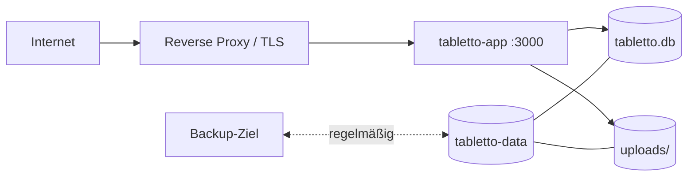
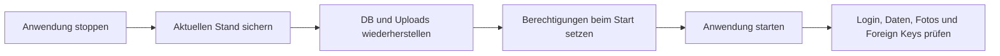

# Betrieb

## Deployment-Topologie



Der Container führt Frontend, API und Scheduler in einem Prozess aus. SQLite und
Uploads liegen gemeinsam unter `/app/data` im Volume `tabletto-data`.

## Compose-Varianten

- `compose.yaml`: Standardkonfiguration mit Scheduler, Uploadpfad, Zeitzone und
  Health Check.
- `docker-compose.prod.yml`: zusätzliche Netzwerk-, Logging-, Security- und
  Ressourcenoptionen; Scheduler, Uploadpfad und Zeitzone sind ebenfalls explizit
  konfigurierbar.

Start:

```bash
cp .env.example .env
docker compose up -d --build
docker compose ps
docker compose logs -f tabletto
```

## Umgebungsvariablen

| Variable | Standard im Code/Compose | Produktion |
|---|---|---|
| `JWT_SECRET` | unsicherer Fallback | zwingend stark und geheim |
| `NODE_ENV` | Compose: `production` | `production` |
| `PORT` | `3000` | intern meist `3000` |
| `DB_PATH` | Compose: `/app/data/tabletto.db` | persistenter Pfad |
| `UPLOADS_PATH` | Compose: `/app/data/uploads` | gemeinsam sichern |
| `FRONTEND_ORIGIN` | `*` | exakte HTTPS-Origin |
| `ENABLE_STOCK_SCHEDULER` | `true` | nur in genau einer Instanz aktiv |
| `STOCK_SCHEDULER_CRON` | `*/5 * * * *` | zur Einnahmefensterlogik passend |
| `TZ` | `Europe/Berlin` | Standortzeitzone |
| `FIX_OPTION` | `a` im Korrekturskript | nur bei bewusster Reparatur |
| `SMTP_HOST` | nicht gesetzt | SMTP-Host für E-Mail-Benachrichtigungen |
| `SMTP_PORT` | `587` | SMTP-Port |
| `SMTP_SECURE` | `false` | `true` für implizites TLS |
| `SMTP_USER` | nicht gesetzt | SMTP-Auth-Benutzer |
| `SMTP_PASS` | nicht gesetzt | SMTP-Auth-Passwort |
| `SMTP_FROM` | nicht gesetzt | Absender (`From`) der Benachrichtigungen |
| `WEEKLY_DIGEST_CRON` | `0 18 * * 0` | Sonntag 18:00 Europe/Berlin |

Änderungen an `JWT_SECRET` melden alle bestehenden Benutzer effektiv ab.

## Persistenz

Im Standardcontainer:

```text
/app/data/tabletto.db
/app/data/tabletto.db-wal       möglich, falls WAL aktiviert würde
/app/data/tabletto.db-shm       möglich, falls WAL aktiviert würde
/app/data/uploads/medications/*
/app/data/backups/*
```

Der Entrypoint setzt `/app/data` rekursiv auf `appuser:appgroup`. Das erleichtert
den Start, verändert aber bei jedem Containerstart die Eigentümerschaft aller
Daten im Mount.

`docker compose down` erhält das benannte Volume. `docker compose down -v`
löscht Datenbank, Uploads und containerinterne Backups dauerhaft.

## Health Check

Beabsichtigte Prüfung:

```bash
curl --fail http://localhost:3000/health
```

Erwartet: `{"status":"ok"}` nach erfolgreichem `SELECT 1`.

Die Route steht vor dem SPA-Fallback. Bei nicht erreichbarer Datenbank liefert sie
HTTP 503 und `{"status":"error"}`. Monitoring sollte Status und JSON prüfen.

## Scheduler

Der Scheduler prüft standardmäßig alle fünf Minuten die benutzerspezifischen
Uhrzeiten. Er läuft in jedem Backendprozess. Deshalb:

- nur eine scheduleraktive Instanz betreiben,
- Zeitzone explizit setzen,
- bei Wartung und Datenkorrektur Scheduler deaktivieren,
- die Tabelle `stock_deductions` bei Auffälligkeiten zusammen mit History prüfen.

Jeder geplante Slot wird über
`UNIQUE (medication_id, slot, scheduled_for)` dauerhaft geclaimt. Wiederholte
Cron-Ticks sind idempotent; Bestandsupdate, Claim und History sind atomar.

## Backup-Strategie

Ein vollständiges Backup umfasst Datenbank und Uploads. Das vorhandene Skript:

```bash
docker compose exec tabletto npm run backup
```

erzeugt unter `/app/data/backups/backup-<zeitstempel>/` mit `VACUUM INTO` einen
konsistenten SQLite-Snapshot, kopiert Uploads und schreibt ein Manifest. Das Ziel
muss anschließend extern verschlüsselt gesichert werden.

Für ein zusätzliches vollständiges Offline-Archiv:

```bash
docker compose stop tabletto
docker run --rm \
  -v tabletto_tabletto-data:/source:ro \
  -v "$PWD/backups:/backup" \
  alpine sh -c 'cd /source && tar czf /backup/tabletto-data.tar.gz .'
docker compose start tabletto
```

Den tatsächlichen Volume-Namen vorher mit `docker volume ls` prüfen. Backups
außerhalb desselben Docker-Hosts aufbewahren und verschlüsseln.

Restore-Tests müssen Datenbankintegrität, Login, Medikamentenzahl, History und
Fotos prüfen.

## Restore



Beispiel für ein vollständiges Archiv:

```bash
docker compose stop tabletto
docker run --rm \
  -v tabletto_tabletto-data:/target \
  -v "$PWD/backups:/backup:ro" \
  alpine sh -c 'rm -rf /target/* && tar xzf /backup/tabletto-data.tar.gz -C /target'
docker compose start tabletto
docker compose logs --tail=100 tabletto
```

Vor dem Überschreiben immer den aktuellen Zustand sichern. Danach mindestens
Login, Medikamentenzahl, History, Fotos und `PRAGMA foreign_key_check` prüfen.

## Updates und Rollback

Update:

```bash
git pull --ff-only
docker compose build --pull tabletto
docker compose up -d
docker compose logs --tail=100 tabletto
```

Vor einem Update ein Restore-getestetes Backup erstellen. Migrationen laufen
automatisch beim Start und besitzen keinen separaten Down-Migrationsmechanismus.
Ein Image-Rollback kann daher allein unzureichend sein; bei inkompatiblem Schema
ist auch ein Daten-Restore erforderlich.

## Reverse Proxy und TLS

Der Proxy leitet HTTP auf Containerport 3000 weiter. Empfohlene Header:

```nginx
location / {
    proxy_pass http://127.0.0.1:3000;
    proxy_set_header Host $host;
    proxy_set_header X-Real-IP $remote_addr;
    proxy_set_header X-Forwarded-For $proxy_add_x_forwarded_for;
    proxy_set_header X-Forwarded-Proto $scheme;
}
```

`FRONTEND_ORIGIN=https://tabletto.example.org` setzen. Express ist derzeit nicht
explizit mit `trust proxy` konfiguriert; Auswirkungen auf IP-basiertes Rate
Limiting hinter einem Proxy vor Produktivbetrieb prüfen.

## Logs und Monitoring

```bash
docker compose ps
docker compose logs -f --tail=200 tabletto
docker stats tabletto-app
docker system df
```

Beobachten:

- Container-Restarts
- Datenbank-/Migrationsfehler
- Scheduler-Start und unerwartet häufige Abzüge
- freier Speicherplatz und Volume-Wachstum
- Rate-Limit- und Auth-Fehler
- Backupalter und Restore-Testergebnis

Schedulerlogs enthalten nur technische Fehler und interne IDs, keine Namen oder
Bestände. Logzugriff bleibt dennoch geschützt.

## Datenkorrektur

`backend/scripts/fix-stock-corruption.js` sucht negative Bestände. Standardmäßig
setzt `FIX_OPTION=a` sie auf null und schreibt `manual_correction` in die History.
Option `b` versucht eine Rekonstruktion anhand historischer Aktionstypen.

Vor Ausführung:

1. Anwendung stoppen oder Scheduler deaktivieren.
2. vollständiges Backup erstellen.
3. Skriptcode und betroffene Datensätze prüfen.
4. `DB_PATH` explizit setzen.
5. Ergebnis und History kontrollieren.

Option `b` sucht teilweise nach dem älteren Aktionstyp `auto_deduction` und kann
die heutigen spezifischen Aktionstypen übersehen. Nicht blind automatisieren.

## Störungsdiagnose

| Symptom | Prüfung |
|---|---|
| Container startet nicht | `docker compose logs`, Secret, Port, Volume-Rechte |
| Health Check schlägt fehl | Antwortinhalt, Route-Reihenfolge, DB-Zugriff |
| Fotos fehlen | `UPLOADS_PATH`, Volume, gespeicherter `photo_path` |
| mehrfacher Abzug | Anzahl Instanzen, Cron, Einnahmezeit, History |
| Import/Export fehlerhaft | Exportversion, Validierungsantwort und Größenlimit prüfen |
| Login nach Redeploy ungültig | Änderung von `JWT_SECRET` |
| DB gesperrt | parallele Prozesse/Backups, offene Schreiboperationen |
