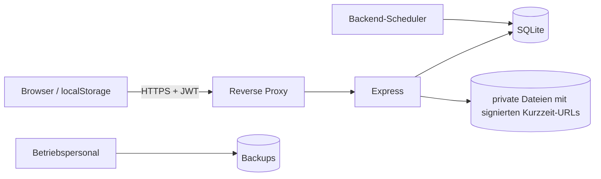

# Sicherheitsmodell

## Schutzbedarf

Tabletto verarbeitet Zugangsdaten und Informationen, aus denen persönliche
Medikation abgeleitet werden kann. Datenbank, Uploads, Backups und Logs sind
daher vertraulich zu behandeln. Die Anwendung ist kein medizinisches Gerät und
soll keine Therapieentscheidung treffen.

## Vertrauensgrenzen

Browser, Proxy, API, persistente Daten und Backups sind getrennte
Vertrauensbereiche. Ein geschützter UI-Pfad ersetzt niemals Backend-Autorisierung.

## Authentifizierung

- Passwörter werden mit bcrypt und Kostenfaktor 10 gehasht.
- JWTs werden mit `JWT_SECRET` signiert und laufen nach sieben Tagen ab.
- JWT-Inhalt: Benutzer-ID und E-Mail; keine Rollen oder medizinischen Daten.
- Fehlender Token ergibt 401, ungültiger/abgelaufener Token 403.
- Fehlgeschlagene Logins sind auf fünf, fehlgeschlagene Registrierungen auf zehn
  Anfragen pro Minute und Client begrenzt.

Risiken:

- Produktion startet ohne ein explizites, vom bekannten Entwicklungswert
  abweichendes `JWT_SECRET` nicht.
- Tokens liegen in `localStorage` und sind bei erfolgreichem XSS auslesbar.
- Es gibt keinen serverseitigen Logout, Token-Widerruf oder Refresh-Mechanismus.
- Hinter Reverse Proxies muss die Client-IP-Ermittlung für Rate Limiting geprüft
  werden; `TRUST_PROXY` setzt die erwartete Proxy-Topologie explizit.

## Autorisierung und Mandantentrennung

Medication-Models begrenzen normale Abfragen durch `id` und `user_id`. History
wird ebenfalls mit `user_id` abgefragt. Dieses Muster ist zwingend beizubehalten.

Alle geschützten Controller verwenden die JWT-Eigenschaft `req.user.id`.

Erforderlicher Regressionstest: Benutzer A darf IDs von Benutzer B weder lesen,
ändern, löschen noch über Fotos oder History erschließen.

## SQL und Datenintegrität

Normale Queries verwenden Platzhalter. Dynamische Update-Spalten werden aus
festen Feldlisten zusammengesetzt. `PRAGMA foreign_keys = ON` erzwingt
Referenzen und Löschkaskaden.

Bestandsupdate und History-Insert sind atomar. Allgemeine Updates durchlaufen die
vollständige Medikamentenvalidierung und dürfen keinen Bestand verändern.
Migrationen brechen bei Fehlern den Start ab. Mehrere App-Prozesse auf derselben
SQLite-Datei bleiben kein unterstütztes Skalierungsmodell.

## Uploads

Schutzmaßnahmen:

- Multer-Limit 5 MiB
- MIME-Typ ist JPEG, PNG, GIF oder WebP
- zufällige serverseitige Dateinamen
- relative Pfade in der Datenbank
- feste serverseitige Erweiterung und Prüfung der Dateisignatur
- Containment-Prüfung nach `path.resolve()`
- fünf Minuten gültige HMAC-signierte Auslieferungs-URL
- Import übernimmt keine Fotoverweise

## CORS und Transport

Ohne `FRONTEND_ORIGIN` ist CORS in Produktion deaktiviert. Ein getrenntes
Frontend muss die exakte HTTPS-Origin setzen. TLS endet typischerweise am Reverse
Proxy; Port 3000 sollte nicht zusätzlich öffentlich erreichbar sein.

Das Backend setzt CSP, `nosniff`, Frame-Schutz, Referrer- und Permissions-Policy.

## PWA-Cache

Der Service Worker cached ausschließlich die statische Anwendungshülle. Private
API-Antworten werden nicht persistiert. Logout entfernt zusätzlich eventuell aus
älteren Releases vorhandene API-Caches.

## Secrets und Konfiguration

- `.env` bleibt unversioniert.
- Secrets über Deploymentplattform oder geschützte Secret Stores setzen.
- Keine Secrets in Compose-Dateien, Images, Logs oder Screenshots schreiben.
- `JWT_SECRET` rotieren, wenn Offenlegung vermutet wird; alle Tokens werden
  dadurch ungültig.
- Produktionsbackups verschlüsseln und getrennt vom Anwendungsserver lagern.
- `SMTP_*`-Variablen bleiben im Backend; sie werden ausschließlich vom
  Mailmodul gelesen und tauchen in keiner API-Antwort oder im PWA-Frontend auf.

## Container

Das Runtime-Image startet über `gosu` als nicht privilegierter `appuser`.
`docker-compose.prod.yml` setzt `no-new-privileges:true`, begrenzt Ressourcen und
rotiert JSON-Logs. Das Standard-Compose enthält diese Optionen nicht vollständig.

Der Entrypoint läuft zunächst als root, um rekursiv Besitzrechte zu ändern. Bei
Bind Mounts muss geprüft werden, ob dies unerwünschte Host-Berechtigungen ändert.

## Logs und Backups

Schedulerlogs enthalten keine Medikamentnamen oder Bestände. Fehlerantworten
enthalten keine Stacktraces oder internen Fehlermeldungen.

Das Backup-Skript erzeugt mit `VACUUM INTO` einen konsistenten SQLite-Snapshot und
kopiert Uploads in dasselbe versionierte Verzeichnis. Externe Verschlüsselung und
Restore-Tests bleiben Betreiberpflicht.

## Produktionscheckliste

- [ ] starkes, extern verwaltetes `JWT_SECRET`
- [ ] HTTPS erzwungen; Port 3000 nicht öffentlich
- [ ] `FRONTEND_ORIGIN` exakt gesetzt
- [ ] nur eine scheduleraktive Instanz
- [ ] persistentes Volume für Datenbank und Uploads
- [ ] verschlüsselte externe Backups und getesteter Restore
- [ ] Zugriff auf Logs und Backups beschränkt
- [ ] Health Check prüft JSON und Datenbank, nicht nur HTTP 200
- [ ] Upload- und PWA-Cache-Risiken für das Einsatzmodell bewertet
- [ ] Abhängigkeiten und Containerbasis regelmäßig aktualisiert
- [ ] Zwei-Benutzer-Autorisierungstests erfolgreich

## Meldung von Schwachstellen

Keine echten Benutzerdaten oder Exploit-Secrets in öffentliche Issues schreiben.
Eine Meldung sollte betroffene Version, reproduzierbare Schritte, Auswirkung und
eine datensparsame Beispielanfrage enthalten.
